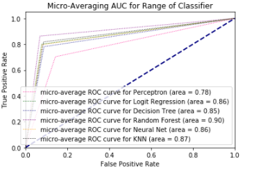
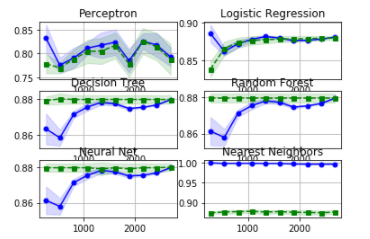
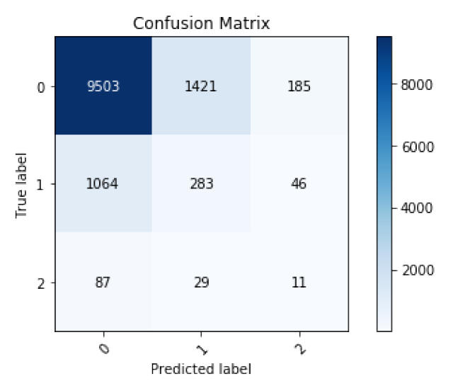

# UK Traffic Accidents 2005 
Exploring a use case of machine learning on UK Traffic Accident data set to classify accident severity

## Introduction
Historically, accidents insurance plans and payments are calculated using actuarial models. Now
with the boom of data collection in insurance industry, we should be able to leverage machine
learning to assist with the insurance industry.
The following project explores a potential usage of machine learning in the insurance industry - to predict the accident severity of a car accident

The target variable is thus accident severity which comes in 3 level:
1. Slight
2. Serious
3. Fatal

Thus, we are dealing with a multi-class classification problem/analysis.

Using this prediction results, we can help insurance companies to:
1. Evaluate insurance claims payment
2. Evaluate the underwriting of insurance plan
3. Insurance claim fraud prediction/investigation

## Data 
The <a href = https://data.gov.uk/dataset/cb7ae6f0-4be6-4935-9277-47e5ce24a11f/road-safety-data> data set <a> is published by UK DoT (Department of Transport), the following analysis is done on a subset of data (Year 2005) as conducting classification analysis with time series becomes quite complex and due to the amount of data, we decided
just to analysis accident information that occurred in the Great Britain in 2005. 
 
 ### Metadata information
 | Variable | Description |
| --- | --- |
| `Accident Index` | Index identifier of accidents |
| `Longitude` | longitude coordinates of accident |
| `Latitude` | latitude coordinates of accident |
| `Accident Severity` | The severity of accident (1 – Slight, 2 - Serious, 3 – Fatal) |
| `Carriageway Hazard` | None - Other object on road - Any animal in carriageway - Pedestrian in carriage - Previous accident - Vehicle load on road    |
| `Date` | The date that accident that occurred in the format DD/MM/YYYY |
| `Day of Week` | The day of the week that accident occurred  |
| `Did Police officer attend scene of accident?` | 1 – No, 2 – Yes, 3, Yes with Ambulance  |
| `Junction Control` | Was there junction control at the location of accident  |
| `Light Conditions` | The lighting condition (Daylight, Darkness - no lighting, Darkness lights lit) |
| `Pedestrian crossing-human control` | Was there pedestrian crossing lights at accident |
| `Pedestrian crossing physical facilities` | Was there pedestrian crossing facilities at accident (e.g. cross-roads)  |
| `Number of Casualties:` | The number of causalities involved in accident |
| `Number of Vehicles:` | The number of vehicles involved in accident |
| `Road Surface Conditions` | The condition of the road during the accident  |
| `Road Type` | The road type where the accident occurred (e.g.one way street)  |
| `Speed limit` | The speed limit where the accident occurred  |
| `Urban or Rural Area` | Did the accident occur in urban or rural setting |
| `Weather Conditions` | The weather condition when the accident occurred  |

## Exploratory Data Analysis

### Geographic Visualization of Accidents in UK
Overlaying the geo-coordinates of accidents with the map, we are able to create a visualization of
the location of the accidents. 

We are able to observe some clustering of accidents in major cities,
and that there seems to be more severity of accidents that occur in rural but hard to tell just from
map. It is interesting to note that there seems to be some accidents that occur in the sea, this may be
due to rounding of the geo-location data or mapping data not 100% accurate. But maybe also
some accidents occurred where the car drove off into the sea, and that why marked as occurred not
on land.

### Accident Severity by Month
Plotting stacked bar plot of accident severity by month, we can observe a slight seasonality
trend though not super obvious.

We can observe that winter period shows a higher number of accidents which make sense as snow
and reduced visibility can cause accidents to occur more frequently. Though from the graph, it
seems that accident severity seems to be quite evenly distributed across the month.

### Accident Severity by Day of the Week
Accident tend to occur more frequently in the weekend + Friday; while decreasing from Monday
to Wednesday

Distribution of accident severity tends to follow the trend of the number of accidents (nothing to
interesting to note)

### Rural vs Urban Traffic Accident Causalities and Severity

It is interesting to observe that there seems to be an different in city type and accident severity. As
from the below scatter plot, we are able to see that on Urban cluster tend to have a lower average
severity and lower number of causalities. While on the other hand rural area tend to have a more
separated cluster, where we see an increasing trend of severity and causalities!

### Accident Severity and Light Conditions
Light condition distribution are quite cardinal (which seem to be the like the case for a lot of our
other categorical variable), furthermore we can observe that the distribution seems to follow for the
different severity, so maybe light conditions may not be such an important variable to predicting
accident severity

## Prediction Model

We first removed non-contextual variables such as date, longitude, latitude variables to create dataset suitable for model prediction. Then as seen with our EDA that most of our categorial variable are quite cardinal thus we perform SMOTE(Synthetic Minority Over Sampling Technique) transformation to the data set to attempt to decrease the bias created by skewed dataset. 

Then using 90% of the data as training and 10% as testing we train (10 folds cross validation and parameters tuning with grid search) various model with training dataset. The following table summarize the various algorithm and its accuracy score with the testing data. 

 | Algorithm | Score |
| --- | --- |
| OvA(Perceptron) | 0.82 |
| OvA(Logistic Regression) | 0.87 |
| Neural Neet | 0.88 |
| Nearest Neighbor | 0.86 |
| Linear SVM | 0.1 |

As Linear SVM has a low score we remove it for the analysis as it would not be helpful for the ensemble model.

Taking a closer look at the learning curve of each model

We observe that the only model that is overfitting the model is KNN while the other looks quite good. Then using an ensemble learning model (e.g. combine the various model to conduct majority voting) we arrive at the following results.

## Implication of the prediction model

Going back to our introduction, the objective is to explore the potential usage of machine learning in the car insurance claims. This model can help in two ways:
1. Insurance Claim - Predict accident severity to help decided the amount/rate of the compensation
2. Fraud Claim - Check whether exaggerated in filling and help decided whether to conduct fraud investigation or not.

## Future Improvements

- To build a model with weighting of information 
- The model may have difficulty classifying serious accidents due to highly skewed dataset
- The model requires all completed data, while this is often not the case 
- Choose our datasets over a longer time span
- Accident prone zone and cause of fatal accidents may change over time

